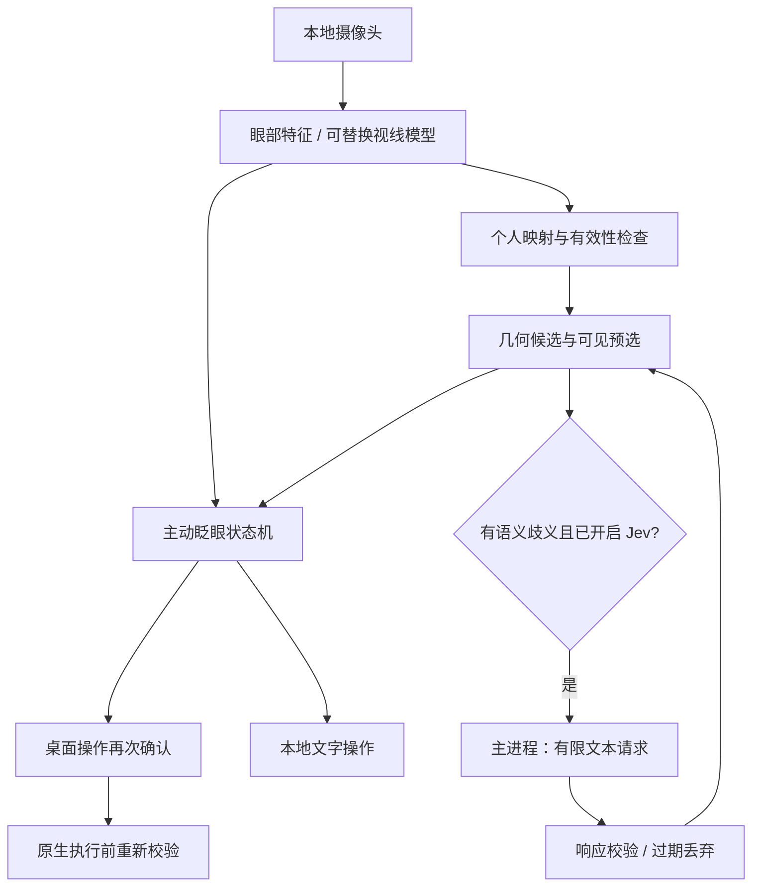

# 架构与数据流

## 边界

| 模块 | 文件 | 职责 |
| --- | --- | --- |
| 视觉 | `src/vision/camera.ts` | 摄像头生命周期、landmarks、开合值、特征 |
| 校准 | `src/core/calibration.ts` | 标准化、岭回归、留出误差；不处理 UI |
| 交互 | `src/core/interaction.ts` | 预选稳定时间、冻结、时长、丢帧、去重 |
| Jev | `src/core/jev.ts` | 构造有限问题、校验分布、超时、鲜度判定 |
| 产品界面 | `src/ui/App.tsx` | 会话、模式、屏幕键盘、状态与确认 |
| 宿主边界 | `src/host.ts`、`electron/preload.cts` | 浏览器降级；有限 IPC 方法 |
| 桌面主进程 | `electron/main.ts` | 凭据、权限、窗口、原生目标缓存 |
| Windows helper | `native/windows.ps1` | 固定 JSON 协议、UIA 枚举/Invoke、有限输入 |

## 四种坐标不能混用

1. 摄像头归一化坐标：landmarks 的 x/y；不是屏幕位置。
2. 校准屏幕归一化坐标：预测的 x/y；可以越界，不把越界值 clamp 到屏幕边缘。
3. Electron 显示器 DIP：`display.x + gaze.x * display.width`。
4. 窗口 CSS 像素：减去窗口 DIP 原点，与 DOM `getBoundingClientRect()` 比较；当前约束为 zoom=1。

UI Automation 返回物理像素矩形，桥在单屏下按 scaleFactor 转为 DIP。初版桌面目标经面板重新布局后，实际选择的是面板 DOM 目标，UIA 矩形用于执行前复查。未来全屏目标覆盖层必须独立验证跨屏、缩放和边缘坐标，不能直接复用面板假设。

## 数据流的时效性

`Observation.at` 使用单调时钟（performance.now），桌面快照有效期使用主进程时间。两者不能混算。

界面布局、文本、模式、候选集合变化时递增 revision。异步 Jev 响应只能更新相同 revision 下、仍存在的候选；闭眼期间拒绝更新。眨眼开始时记录已经显示并稳定的目标和 revision。睁眼时两者仍有效才触发一次提交。

摄像头事件间隔超过 200 ms 则状态机清空，不能把“卡住的闭眼帧”当成有效确认。渲染层超过 300 ms 无新帧显示跟踪中断。两个阈值是原型参数，后续需要结合设备帧率调优。

## 本地与云

- 原始视频、面部特征、开合序列和完整屏幕截图不发给 Jev。
- 显式打开 Jev 开关后，候选标签和末尾最多 160 字上下文可能离开本机；这些文字仍可能包含个人信息，界面必须说明。
- API key 只从桌面主进程环境/.env 读取，不进入 Vite 客户端变量或浏览器 bundle。
- 默认不保存视频、文本、特征日志。评测使用用户主动导出的匿名事件文件；不要将真人记录提交到公开仓库。
- 浏览器预览使用本地演示宿主，不能控制操作系统，也不会直接向 Jev 发请求。

## 原生执行边界

renderer 不传可执行代码、脚本、shell 参数或任意 URL。只能请求有限动作：读取窗口、启用/禁用、点击缓存目标、滚动、输入已确认文字。

主进程对 IPC 来源、数据长度和枚举值做检查；每个快照有单次 token 和 12 秒有效期。Windows helper 复查前台窗口和目标是否仍可用；Invoke 前比较矩形。焦点改变或超时要求重新读取。所有桌面动作先经本地确认，Jev 无权取消确认。

PowerShell 桥方便审阅，但还没有 Windows 实机验证。后续应换为签名 .NET helper、限制可操作模式并覆盖更多编辑控件。当前版本不声称支持管理员窗口、任意画布点击、系统密码输入或远程桌面内部语义。

## 可替换点

视觉模型统一输出 `Observation`，因此 A/B 试验不修改 BlinkController。新模型先实现相同输入时间戳、quality、features/point 约定；若直接输出屏幕点，也必须经过独立校准评测。

目前视觉推理在渲染线程运行。待测任务是搬入 Worker/独立进程并测 UI 响应；不能在没有 profiling 的情况下声称已经达到 30 FPS。
