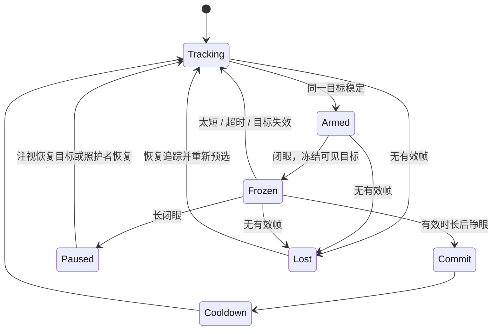

# 交互状态与 Jev 决策合同

## 眨眼的语义

眼睛看向目标只是预选，主动眨眼才是确认。自然眨眼被忽略。0.1 默认时长 350–850 ms、预选稳定 220 ms、提交后冷却 650 ms、连续闭眼 1400 ms 暂停。这是可调工程起点，不是 ALS 生理结论。



暂停保留已输入文字，取消未完成确认，停止桌面控制。恢复按钮使用一秒左右的驻留，仅为恢复入口；当前不是完整驻留输入模式。收起状态中的小图标尚不是低精度用户可用的完整解决方案，可试用版本需要扩大的边缘唤醒区域。

## 谁决定什么

| 问题 | 本地代码 | Jev |
| --- | --- | --- |
| 眼睛是否被检测到、是否闭合 | 是 | 不接收视频 |
| 几何距离、时间阈值、有效域 | 是 | 不做数值计算 |
| 输入哪个字母 | 明确命中 + 用户确认 | 0.1 不自动为字母纠错 |
| 少量词候选哪一个更符合现有上下文 | 生成候选与约束 | 有歧义时可建议；必须允许 none |
| 桌面控件的语义后果 | 枚举/规则 + 所有动作确认 | 可额外标记，不能放松规则 |
| 用户是否授权点击或发送 | 眨眼状态机 + 明确确认 | 无权判断授权 |
| 最后执行和是否重试 | 是 | 只返回结构化答案 |

## 触发策略

不按帧请求。局部存在至少两个语义候选、几何不能唯一判定、用户开启云辅助、追踪有效、眼睛睁开，才有资格请求。字母、暂停、确认/取消等控制始终走本地。第一版 Jev 自动入口仅用于词候选；桌面语义实验须另有用户明确任务后才扩展。

renderer 至少间隔 750 ms；主进程限并发 1 和最短间隔 650 ms；一次请求超时 900 ms。本地可明确选择时不等待网络。过期请求不重试：实时目标已经可能变了，通用后台任务的指数退避不适合直接重放一次点击判断。

## 请求构造

实现源：`src/core/jev.ts`。以 `buildJevRequest()` 为权威，避免文档和代码出现两份不同 prompt。`npm run jev:smoke -- --dry-run` 打印完全由合成数据构造的请求，不需要 key。

字段协议：

| 字段 | 来源/上限 | 作用 |
| --- | --- | --- |
| `model` | 环境变量；开发默认 jev-latest | 评测时固定模型版本并记录响应版本 |
| `state.schema` | 常量版本 | 更改合同后可定位实验版本 |
| `mode` / `language` | 会话 | 区分文字/桌面与语言 |
| `text.prefix` | 最后 160 字 | 只提供局部上下文 |
| `task` | 明确、短的任务描述，最多 120 字 | 不伪造用户想做的事 |
| `candidates` | 本地计算的 1–4 项 | ID、标签、类型、动作、近邻证据 |
| `questions.target` | Choice | 从本次 ID 和 none 中选一个 |
| `questions.consequential` | 仅桌面研究上下文的 Noul | 是否有看起来后果较大的候选；文字请求省略 |

Choice 的 instruction 要完整表达问题：问题 ID `target` 本身不会被模型用于推理。候选标签、已输入文字和网页文字都是数据，不是模型指令。每个候选的语义和证据需就地写清，不让模型追逐多层引用。geometry 的原始浮点数不发送，先由代码转为有限证据类别。

示意上下文（完整 HTTP envelope 由脚本生成）：

```json
{
  "schema": "jevforsteve.context.v1",
  "mode": "write",
  "language": "en",
  "text": {"prefix": "I would like some wa"},
  "task": "Select a literal word completion from the visible local suggestions.",
  "candidates": [
    {"id":"word-water","label":"water","kind":"word","action":"word","evidence":"nearby"},
    {"id":"word-wait","label":"wait","kind":"word","action":"word","evidence":"nearby"}
  ]
}
```

期望是建议高亮 water 或弃权；不是直接输入 water。即使这个例子看似简单，也只能算合成合同案例，不能当作模型已经在线答对。

## 响应处理

HTTP 成功 → JSON 能解析 → 所请求的答案类型正确 → Choice ID 属于本轮白名单 → 概率有限、范围合法、覆盖全部选项且和近似 1 → choice 与最大概率一致 → 工程阈值 → 本地时效检查 → 更新可见预选。

初始接受阈值是候选概率 ≥0.75 且与第二名差 ≥0.25；这是等待验证的参数。Noul 用于后续桌面语义研究；当前所有桌面动作始终必须确认，无论该值大小。不能拿 `confidence > 0.9` 当作“错误概率 <10%”，更不能当用户授权。

一旦进入闭眼，拒绝异步模型改变选择；睁眼提交冻结目标。若 UI、文本、候选、模式、云开关改变，revision 作废。一个旧词候选不能在用户已经开始输入下一字母后突然提交。

## Jev 评测用例

| 类别 | 必须覆盖 |
| --- | --- |
| 普通词 | 同前缀、多义词、上下文不足 |
| 忠于原文 | 姓名、新词、否定、不合语法但故意输入 |
| 中文 | 常用词、同音候选、方言/人名；单独报告 |
| 不可信内容 | 标签包含“忽略前文”、伪装成指令 |
| 故障 | 401/429/529、超时、JSON 错误、遗漏概率 |
| 时序 | 响应到达时已经闭眼、换页、删除或暂停 |

离线测几何基线、词频基线、词频 + Jev 的配对增益。在线小规模试用采用交叉顺序；主要终点是错误提交与修正后速度。模型没有净收益则默认关闭，这不影响核心产品成立。
